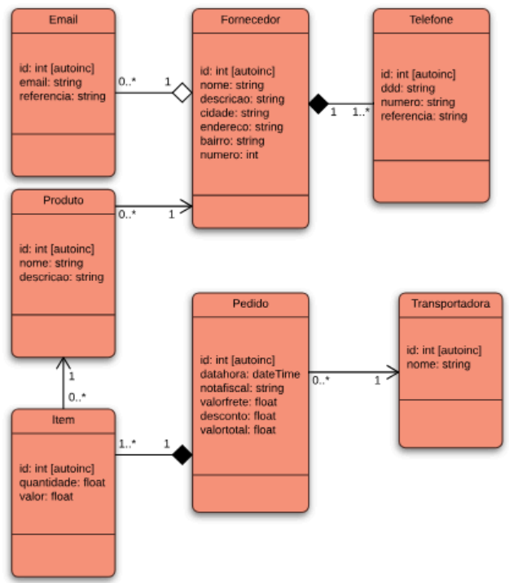

# RubyOnRails_Especificacoes_do_Banco_De_Dados

<h1>Parte 1</h1>

<br />



<br />

<p>
    Foram criadas as tabelas "Fornecedor", "Transportadora", "Item", "Pedido", "Telefone", "Email" e "Produto". Cada tabela seguindo o padrão informado no diagrama. Todo o Script SQL foi formulado no banco de dados postgreSql, devido a isso a tipagem de alguns campos se encontra diferende do diagrama:
</p>

<ul>
    <li>O tipo "INT [AUTO INCREMENTAVEL]" ficou como "SERIAL"</li>
    <li>O tipo "INT" ficou como "INTEGER"</li>
    <li>O tipo "STRING" ficou como "TEXT"</li>
    <li>O tipo "FLOAT" ficou como "NUMERIC"</li>
    <li>O tipo "DATATIME" ficou como "timestamp without time zone"</li>
</ul>

<br />

<p>
    Para melhor normalizacão do banco de dados foram criadas colunas que não se encontram no diagrama:
</p>

<ul>
    <li>Na tabela "Item" foi criada a chave estrangeira "id_produto" e "id_pedido"</li>
    <li>Na tabela "Pedido" foi criada a chave estrangeira "id_transportadora" </li>
    <li>Na tabela "Telefone" foi criada a chave estrangeira "id_fornecedor" </li>
    <li>Na tabela "Email" foi criada a chave estrangeira "id_fornecedor" </li>
    <li>Na tabela "Produto" foi criada a chave estrangeira "id_fornecedor" </li>
</ul>

<p>
    Também foram implementadas as seguintes configurações: 
</p>

<ul>
    <li>Na tabela "Email": ID NOT NULL AUTOINCRMENT (SERIAL) PRIMARY KEY, ID_FORNECEDOR NOT NULL.</li>
    <li>Na tabela "Fornecedor": ID NOT NULL AUTOINCRMENT (SERIAL) PRIMARY KEY.</li>
    <li>Na tabela "Item": ID NOT NULL AUTOINCRMENT (SERIAL) PRIMARY KEY, ID_PRODUTO E ID_PEDIDO NOT NULL.</li>
    <li>Na tabela "Pedido": ID NOT NULL AUTOINCRMENT (SERIAL) PRIMARY KEY, DATAHORA DEFAULT DATA E HORA ATUAL.</li>
    <li>Na tabela "Produto": ID NOT NULL AUTOINCRMENT (SERIAL) PRIMARY KEY, ID_FORNECEDOR NOT NULL.</li>
    <li>Na tabela "Telefone": ID NOT NULL AUTOINCRMENT (SERIAL) PRIMARY KEY, ID_FORNECEDOR NOT NULL.</li>
    <li>Na tabela "Transportadora": ID NOT NULL AUTOINCRMENT (SERIAL) PRIMARY KEY.</li>
</ul>

# RubyOnRails_Script_Banco_De_Dados

<br />

<h1>Script SQL</h1>

<br />

[Ver script SQL](script.sql)

<br />

```sql

--Transporte
CREATE TABLE IF NOT EXISTS transportadora
(
    id SERIAL,
    nome text NOT NULL,
    CONSTRAINT transportadora_id_pk PRIMARY KEY (id)
);

-- Fornecedor
CREATE TABLE IF NOT EXISTS fornecedor
(
    id SERIAL,
    nome text,
    descricao text,
    cidade text,
    endereco text,
    bairro text,
    numero integer,
    CONSTRAINT fornecedor_id_fk PRIMARY KEY (id)
);

-- E-mail
CREATE TABLE IF NOT EXISTS  email
(
    id SERIAL,
    email text,
    referencia text,
    id_fornecedor integer NOT NULL,
    CONSTRAINT email_id_pk PRIMARY KEY (id),
    CONSTRAINT email_id_fornecedor_fk FOREIGN KEY (id_fornecedor)
        REFERENCES fornecedor (id) MATCH SIMPLE
        ON UPDATE RESTRICT
        ON DELETE RESTRICT
);

-- Pedido
CREATE TABLE IF NOT EXISTS pedido
(
    id SERIAL,
    datahora timestamp without time zone DEFAULT CURRENT_DATE,
    notafiscal text,
    valorfrete numeric,
    desconto numeric,
    valortotal numeric,
    id_transportadora integer NOT NULL,
    CONSTRAINT pedido_id_pk PRIMARY KEY (id),
    CONSTRAINT pedido_id_transportadora_fk FOREIGN KEY (id_transportadora)
        REFERENCES transportadora (id) MATCH SIMPLE
        ON UPDATE RESTRICT
        ON DELETE RESTRICT
);

-- Produto
CREATE TABLE IF NOT EXISTS produto
(
    id SERIAL,
    nome text,
    descricao text,
    id_fornecedor integer NOT NULL,
    CONSTRAINT produto_id_pk PRIMARY KEY (id),
    CONSTRAINT produto_id_fornecedor_fk FOREIGN KEY (id_fornecedor)
        REFERENCES fornecedor (id) MATCH SIMPLE
        ON UPDATE RESTRICT
        ON DELETE RESTRICT
);

-- Item
CREATE TABLE IF NOT EXISTS item
(
    id SERIAL,
    quantidade numeric,
    valor numeric,
    id_produto integer NOT NULL,
    id_pedido integer NOT NULL,
    CONSTRAINT item_id_pk PRIMARY KEY (id),
    CONSTRAINT item_id_pedido_fk FOREIGN KEY (id_pedido)
        REFERENCES pedido (id) MATCH SIMPLE
        ON UPDATE RESTRICT
        ON DELETE RESTRICT,
    CONSTRAINT item_id_produto_fk FOREIGN KEY (id_produto)
        REFERENCES produto (id) MATCH SIMPLE
        ON UPDATE RESTRICT
        ON DELETE RESTRICT
);

-- Telefone
CREATE TABLE IF NOT EXISTS telefone
(
    id SERIAL,
    ddd text,
    numero text,
    referencia text,
    id_fornecedor integer NOT NULL,
    CONSTRAINT telefone_id_pk PRIMARY KEY (id),
    CONSTRAINT telefone_id_telefone_fk FOREIGN KEY (id_fornecedor)
        REFERENCES fornecedor (id) MATCH SIMPLE
        ON UPDATE RESTRICT
        ON DELETE RESTRICT
);

```sql
